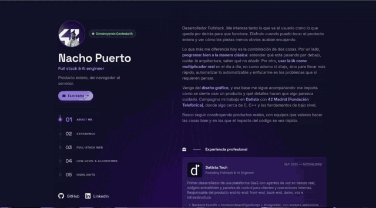

<!-- Hero banner -->

  

<!-- Selector de idioma -->

  
  &nbsp;
  

<!-- Typing cycler de roles -->

  

<!-- Portfolio hero (clickable → portfolio) -->

  

  

<!-- Estado + contacto -->

  

  
  
  

  

## 🔭 Ahora mismo

Desarrollando **[Contestaria](#)** en **Datista Tech** como primer ingeniero — un producto de voz-IA en tiempo real sobre telefonía SIP. De cero a producción:

- 🐍 **Backend** — Python + **FastAPI**, PostgreSQL, workers asíncronos con Celery + Redis.
- ⚛️ **Frontend** — React + TypeScript: dashboards, widgets embebibles y webs públicas.
- 🎙️ **Pipeline de voz** — FreeSWITCH + LiveKit para SIP en tiempo real, bucle **STT → LLM → TTS**.
- 🐳 **Infra** — Docker multi-servidor, red privada con WireGuard y observabilidad completa (**Prometheus + Grafana + Loki + Alertmanager** con alertas a Telegram).
- 🤖 **Automatización interna** — n8n + Claude + APIs de OpenAI para optimizar procesos del equipo y de la operativa.

<!-- TODO: enlazar Contestaria / Datista Tech — añadir URLs de webs públicas + GIFs cuando se elijan -->

  

## 🏆 Reconocimientos

- 🥇 **Primero de mi promoción** en **42 Madrid** (Fundación Telefónica)
- 🏆 **Fittracker** — seleccionado para representar a 42 Madrid en el **International HackShow**

  

## 🛠️ Stack

  

  
  
  
  
  
  
  
  
  
  
  
  
  

  

## 🌟 Proyectos destacados

### 🏋️ Fittracker &nbsp;🏆 International HackShow

<table width="100%">
  <tr>
    <td width="42%"></td>
    <td width="58%">
      App fullstack para registrar entrenamientos y comidas en el mismo dashboard. Seleccionado por 42 Madrid para representar a la escuela en el International HackShow.
        
      <strong>Stack:</strong> React · Vite · Node + Express · MongoDB · Fly.io
        
      
      
    </td>
  </tr>
</table>

### 💪 Gymtracker v2

<table width="100%">
  <tr>
    <td width="42%">
      
    </td>
    <td width="58%">
      Evolución de Fittracker centrada en el flujo de gimnasio. Builder de rutinas drag-and-drop, tracker en sesión con peso/series/repes y calendario de histórico.
        
      <strong>Stack:</strong> React 19 · TypeScript · Tailwind v4 · Zustand · @dnd-kit · Express · MongoDB · Fly.io (x2)
        
      
    </td>
  </tr>
</table>

### 🧱 Cub3D &nbsp;42 · motor 3D

<table width="100%">
  <tr>
    <td width="42%"></td>
    <td width="58%">
      Motor 3D en primera persona construido con raycasting + DDA en C. Paredes, suelo y techo texturizados, shading en función de la distancia y HUD básico.
        
      <strong>Stack:</strong> C · MiniLibX · Raycasting + DDA
        
      
    </td>
  </tr>
</table>

### 🎬 Reelations

<table width="100%">
  <tr>
    <td width="42%"></td>
    <td width="58%">
      Red social pequeña alrededor del cine: buscar, reseñar, hacer listas y seguir a otros. Renderizado en servidor con Handlebars sobre Express + MongoDB y sesiones persistidas en Mongo.
        
      <strong>Stack:</strong> Node · Express · MongoDB · Handlebars · Docker · Fly.io
        
      
      
    </td>
  </tr>
</table>

### 🌲 Adventure Forest

<table width="100%">
  <tr>
    <td width="42%"></td>
    <td width="58%">
      Endless runner 2D con HTML5 Canvas y JavaScript vanilla. Game loop, parallax, clases de entidad, colisiones y leaderboard local — sin framework, sin build.
        
      <strong>Stack:</strong> HTML5 Canvas · JS vanilla · Netlify
        
      
      
    </td>
  </tr>
</table>

  

## 📟 Proyectos de 42 Madrid &nbsp;Low-level · C · C++ · Shell · Docker

<table align="center">
  <tr>
    <th>📁 Proyecto</th>
    <th>💻 Lenguaje</th>
    <th>🔗 Repo</th>
    <th>ℹ️ Descripción</th>
  </tr>
  <tr>
    <td>💬 ft_irc</td>
    <td>C++</td>
    <td></td>
    <td>Servidor IRC en C++98 con <code>poll()</code>, canales y comandos de operador.</td>
  </tr>
  <tr>
    <td>🧱 Cub3D</td>
    <td>C</td>
    <td></td>
    <td>Motor 3D en primera persona con raycasting + DDA.</td>
  </tr>
  <tr>
    <td>🧠 Módulos C++</td>
    <td>C++</td>
    <td></td>
    <td>Módulos cpp00–cpp08: clases, sobrecarga de operadores, templates, excepciones, STL.</td>
  </tr>
  <tr>
    <td>🐳 Inception</td>
    <td>Docker / Bash</td>
    <td></td>
    <td>Infraestructura desde cero: NGINX, WordPress + php-fpm, MariaDB + servicios bonus.</td>
  </tr>
  <tr>
    <td>💾 Minishell</td>
    <td>C</td>
    <td></td>
    <td>Shell personalizada implementada desde cero.</td>
  </tr>
  <tr>
    <td>🍝 Philosophers</td>
    <td>C</td>
    <td></td>
    <td>Problema clásico de los filósofos con hilos y mutexes.</td>
  </tr>
  <tr>
    <td>♻️ Push_swap</td>
    <td>C</td>
    <td></td>
    <td>Ordenación de números con mínimos movimientos sobre dos stacks (algoritmo turco).</td>
  </tr>
  <tr>
    <td>🔗 Pipex</td>
    <td>C</td>
    <td></td>
    <td>Pipeline de shell reconstruida con <code>fork</code>, <code>execve</code>, <code>pipe</code> y <code>dup2</code>.</td>
  </tr>
  <tr>
    <td>🕹️ So_long</td>
    <td>C</td>
    <td></td>
    <td>Juego 2D con MiniLibX y parseo de mapa con Flood Fill.</td>
  </tr>
  <tr>
    <td>🖨️ Ft_printf</td>
    <td>C</td>
    <td></td>
    <td>Réplica de <code>printf</code> con argumentos variádicos y parseo de formato.</td>
  </tr>
  <tr>
    <td>🧵 Get_next_line</td>
    <td>C</td>
    <td></td>
    <td>Leer un file descriptor línea a línea — memoria dinámica y buffers.</td>
  </tr>
  <tr>
    <td>📚 Libft</td>
    <td>C</td>
    <td></td>
    <td>Funciones básicas de libc reimplementadas desde cero.</td>
  </tr>
</table>

  

  ¿Buscando un fullstack / AI engineer? Escríbeme a <a href="mailto:nachopuerto95@gmail.com">nachopuerto95@gmail.com</a> o por <a href="https://www.linkedin.com/in/nacho-puerto-mendoza/">LinkedIn</a>.

